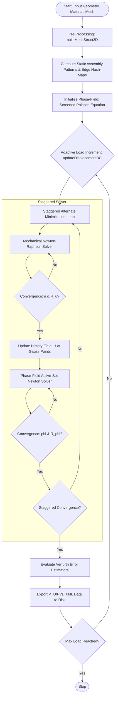

# PFCOMPAS-v1.0.0: Phase-Field Modeling of Fracture

PFCOMPAS-v1.0.0 is a self-contained, high-performance MATLAB software package for quasi-static brittle fracture based on the regularized AT2 functional. Designed for structural engineers and computational mechanicians, the framework bypasses standard interpreted-language limitations via a parallel map-reduce assembly engine utilizing precomputed sparsity patterns, achieving near-compiled execution rates.

## Core Features
* **Constitutive Asymmetry:** Natively incorporates isotropic, Amor volumetric-deviatoric, and Miehe spectral tension-compression splits.
* **Algorithmic Rigor:** Deploys hyperbolically smoothed Macaulay brackets with dynamic scale invariance to provide exact, $C^{1}$-continuous consistent tangents. 
* **Cohesive Zone Library:** Integrates 10 distinct degradation functions to artificially delay crack nucleation and simulate threshold-based cohesive zone behaviors.
* **Spatial Diagnostics:** Features an explicit spatial diagnostic suite based on Verfürth a posteriori error estimators, which evaluate localized traction and damage gradient interface flux jumps across interior edges.
* **Adaptive Controller:** An adaptive predictive load-stepping heuristic dynamically scales load increments to bypass manual tuning across stiff pre-cracking and unstable post-peak softening regimes.

## Requirements
* MATLAB (> R2021a)
* Parallel Computing Toolbox

## Installation & Quick Start
1. Clone the repository to your local machine:
   `git clone https://github.com/NUmerically-Stable/PF-COMPAS.git`
2. Add the repository directory and its subfolders to your MATLAB path.
3. **Run the Minimal Working Example (MWE):**
   Open MATLAB and execute the Single Edge Notched Tension (SENT) benchmark:
   `main.m`
   *This script autonomously loads the mesh (make sure to add it to path), executes the adaptive staggered active-set Newton solver, and streams output data to the disk.*

## Visualization
State variables are streamed directly to disk as XML Unstructured Grid files (`.vtu`) and registered within a master temporal collection wrapper (`.pvd`), preserving workstation memory. Open the `.pvd` file in ParaView to analyze the chronological evolution of the damage field and Verfürth error indicators.

## Documentation
Comprehensive theoretical formulations, Jacobian derivations, and algorithmic flowcharts are available in the [PFCOMPAS-v1.0.0 Documentation Report](docs/PFCOMPAS-v1.0.0_Documentation.pdf).

## License
This project is licensed under the MIT License - see the `LICENSE` file for details. 

## Contact
For questions or support, contact Pranjal Saxena (pranjals21@iitk.ac.in or contactpranjal02@gmail.com).
